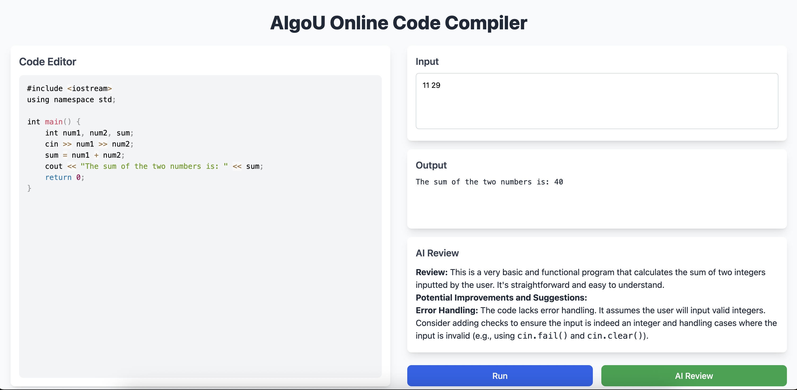

# AlgoU — AI-Powered Coding Platform

> Practice Coding. Learn Faster. Get AI Feedback.

[](https://algou-git-main-algo-u.vercel.app)



---

## Features

- 🔐 Email & Google OAuth Authentication
- 💻 Online Compiler — C++, C, Python
- 🤖 AI Code Review — Gemini AI
- 🧩 LeetCode-style Coding Problems
- 📊 Dashboard with Stats & Streaks
- 📝 Submission History

---

## Tech Stack

**Frontend** — React, Vite, Tailwind CSS, Monaco Editor  
**Backend** — Node.js, Express, MongoDB, JWT, Passport.js  
**AI** — Google Gemini API  
**Deployment** — Vercel (frontend) + Render (backend) + MongoDB Atlas

---

## Local Setup

```bash
# Backend
cd backend
npm install
# Create .env with MONGO_URI, JWT_SECRET, GOOGLE_CLIENT_ID, GOOGLE_CLIENT_SECRET, GEMINI_API_KEY
node seedProblems.js
node index.js

# Frontend
cd frontend
npm install
# Create .env with VITE_API_URL=http://localhost:5000
npm run dev
```

---

## Live URLs

| Service  | URL                                      |
| -------- | ---------------------------------------- |
| Frontend | https://algou-git-main-algo-u.vercel.app |
| Backend  | https://algou-backend.onrender.com       |

---

Built by **V. Surya Teja** — BTech, IIT Indore
