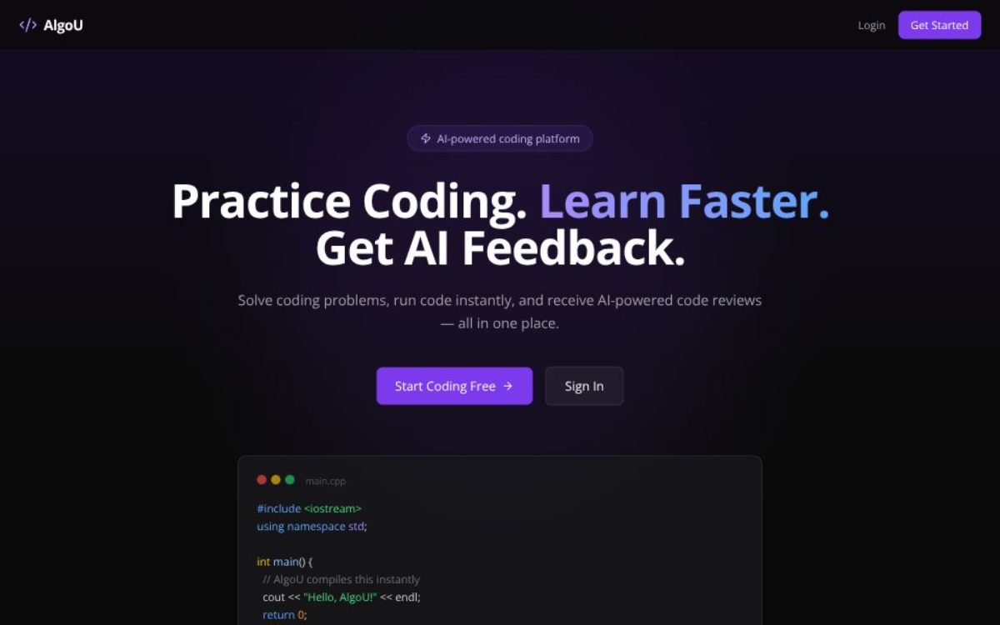

<div align="center">

# AlgoU — AI-Powered Coding Platform

### Practice Coding. Learn Faster. Get AI Feedback.

[](https://algou-git-main-algo-u.vercel.app)
[](https://algou-backend.onrender.com)
[](https://mongodb.com)

</div>

---



---

## 📌 About

AlgoU is a full-stack coding platform built for students and developers who want to improve their problem-solving skills. It combines an online code compiler, AI-powered code reviews, and LeetCode-style coding problems — all in one dark, modern interface.

Built as a **Bachelor's Thesis Project** at **IIT Indore** by V. Surya Teja.

---

## ✨ Features

| Feature             | Description                                         |
| ------------------- | --------------------------------------------------- |
| 🔐 Authentication   | Email/Password signup & Google OAuth 2.0 login      |
| 💻 Online Compiler  | Write and run C++, C, and Python code instantly     |
| 🤖 AI Code Review   | Get structured feedback powered by Google Gemini AI |
| 🧩 Coding Problems  | LeetCode-style problems with hidden test cases      |
| 📊 Dashboard        | Track problems solved, submissions, and streaks     |
| 👤 User Profile     | Update name, profile picture, and password          |
| 📝 Submissions      | View full submission history with your code         |
| 🔒 Protected Routes | Unauthenticated users redirected to login           |

---

## 🛠️ Tech Stack

### Frontend

- **React 18** + **Vite** — Fast, modern UI framework
- **Tailwind CSS** — Utility-first styling
- **Monaco Editor** — VS Code-style code editor in browser
- **React Router v6** — Client-side routing
- **Axios** — HTTP requests with JWT interceptor
- **Lucide React** — Icon library

### Backend

- **Node.js** + **Express** — REST API server
- **MongoDB** + **Mongoose** — NoSQL database
- **JWT (jsonwebtoken)** — Secure authentication tokens
- **Passport.js** — Google OAuth 2.0 strategy
- **bcryptjs** — Password hashing
- **Google Gemini AI** — AI code review generation
- **g++ / Python** — Code execution engine

### DevOps & Deployment

- **Vercel** — Frontend hosting with automatic deploys
- **Render** — Backend hosting (free tier)
- **MongoDB Atlas** — Cloud-hosted database
- **GitHub** — Version control & CI/CD trigger

---

## 📁 Project Structure

```
Online-Compiler/
├── backend/
│   ├── config/
│   │   ├── db.js              # MongoDB connection
│   │   └── passport.js        # Google OAuth
│   ├── controllers/
│   │   ├── authController.js  # Auth logic
│   │   └── userController.js  # Profile logic
│   ├── middleware/
│   │   └── authMiddleware.js  # JWT middleware
│   ├── models/
│   │   ├── User.js            # User schema
│   │   ├── Problem.js         # Problem schema
│   │   └── Submission.js      # Submission schema
│   ├── routes/
│   │   ├── authRoutes.js
│   │   ├── userRoutes.js
│   │   └── problemRoutes.js
│   ├── aiCodeReview.js        # Gemini AI
│   ├── executeCode.js         # Code execution
│   ├── generateFile.js        # Temp file creation
│   ├── keepAlive.js           # Prevent cold start
│   ├── seedProblems.js        # Seed DB with problems
│   └── index.js               # Server entry point
│
└── frontend/
    └── src/
        ├── api/axios.js           # Axios + JWT interceptor
        ├── context/AuthContext.jsx # Global auth state
        ├── components/
        │   ├── Navbar.jsx
        │   ├── ProtectedRoute.jsx
        │   ├── StatsCard.jsx
        │   └── GoogleAuthButton.jsx
        └── pages/
            ├── Landing.jsx
            ├── Login.jsx
            ├── Signup.jsx
            ├── Dashboard.jsx
            ├── Profile.jsx
            ├── Compiler.jsx
            ├── Problems.jsx
            └── ProblemSolve.jsx
```

---

## ⚙️ Local Development

### Prerequisites

- Node.js v18+
- MongoDB Atlas account (free)
- Google Cloud Console project (for OAuth)
- Gemini API key (free from [aistudio.google.com](https://aistudio.google.com))

### 1. Clone the repo

```bash
git clone https://github.com/Manthru/Online-Compiler.git
cd Online-Compiler
```

### 2. Backend setup

```bash
cd backend
npm install
```

Create `backend/.env`:

```env
PORT=5000
MONGO_URI=your_mongodb_atlas_connection_string
JWT_SECRET=your_secret_key
GOOGLE_CLIENT_ID=your_google_client_id
GOOGLE_CLIENT_SECRET=your_google_client_secret
CLIENT_URL=http://localhost:5173
GEMINI_API_KEY=your_gemini_api_key
```

Seed the database with 3 starter problems:

```bash
node seedProblems.js
```

Start the backend:

```bash
node index.js
```

### 3. Frontend setup

```bash
cd frontend
npm install
```

Create `frontend/.env`:

```env
VITE_API_URL=http://localhost:5000
```

Start the frontend:

```bash
npm run dev
```

Open `http://localhost:5173` 🎉

---

## 🌐 Deployment

| Service  | Platform      | URL                                      |
| -------- | ------------- | ---------------------------------------- |
| Frontend | Vercel        | https://algou-git-main-algo-u.vercel.app |
| Backend  | Render        | https://algou-backend.onrender.com       |
| Database | MongoDB Atlas | Cloud hosted                             |

> ⚠️ **Note:** The backend runs on Render's free tier which sleeps after 15 minutes of inactivity. First request may take up to 50 seconds to wake up.

---

## 🔮 Roadmap

- [ ] More problems across Easy / Medium / Hard
- [ ] Timed contest system
- [ ] Global leaderboard
- [ ] Discussion section per problem
- [ ] Java and JavaScript support
- [ ] Daily coding streak system
- [ ] Problem bookmarks and notes

---

## 🤝 Contributing

Pull requests are welcome! For major changes, please open an issue first to discuss what you would like to change.

## 📄 License

This project is open source and available under the [MIT License](LICENSE).

---

<div align="center">
  Built with ❤️ using React, Node.js, MongoDB, and Google Gemini AI
</div>
